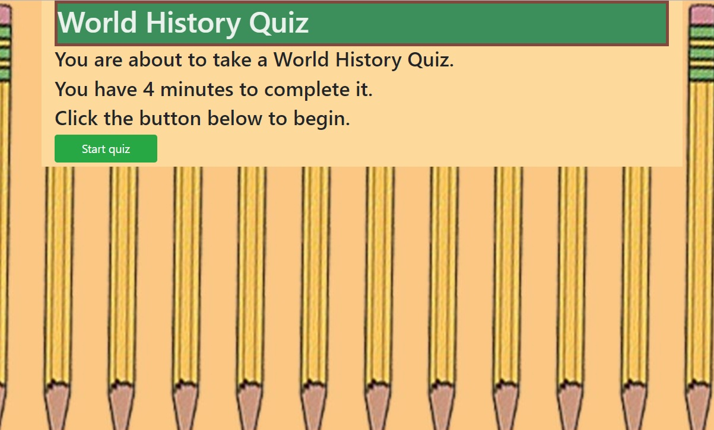

# TriviaGame
## World History Trivia 
-------
## Description
This game takes you back to your High School World History class. You will have 4 minutes to take an 11 minute test. The test has questions about the Roman Empire and goes all the way until the Cold War.
-------
## Technology Used 
This game was written with HTML5, CSS3, JavaScript, and jQuery 3.3.1
Background image was taken by [Erol Ahmed](https://unsplash.com/@erol)
------
## Screenshot
